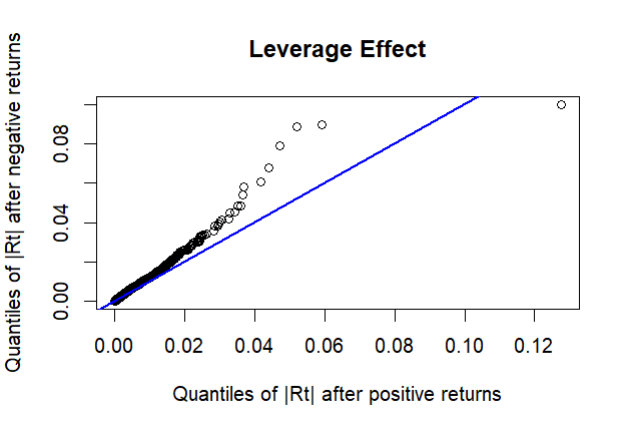

# Exact Greeks under a Misspecified Model vs Estimated Greeks under a Correct One

**A Monte Carlo Study of Hedging Error** · MSc Financial Mathematics Dissertation · Brunel University London
Supervisor: Dr Jia Wei Lim

Does a hedge built on **exact Greeks from the wrong process** (Black–Scholes / GBM) beat one built on **estimated Greeks from the right process** (Heston, via Monte Carlo finite differences)? The question is tested on the S&P 500, first with a delta-only hedge and then with delta–vega.

---

## Contents

1. [Headline Results](#headline-results)
2. [Data](#1-data)
3. [Why Not GBM?](#2-why-not-gbm)
4. [The Heston Model](#3-the-heston-model)
5. [Calibration](#4-calibration)
6. [Simulation: Euler vs QE](#5-simulation-euler-vs-qe)
7. [Hedging Experiment](#6-hedging-experiment)
8. [Results](#7-results)
9. [Limitations](#limitations)
10. [Requirements](#requirements)
11. [References](#references)

---

## Headline Results

Terminal hedging error (RMSE, index points) of a written December 7800 SPX call, premium 327.70, 1,000 paths, 127 daily rebalances:

| Hedge | GBM (exact BS Greeks) | Heston (MC finite-difference Greeks) | Heston (semi-closed Greeks) |
|---|---|---|---|
| Delta | 164.23 | 166.23 | 166.07 |
| Delta–Vega | 347.65 | **27.14** | **25.62** |

- **Delta only:** no significant RMSE difference (paired bootstrap $p = 0.72$). BS wins on MAE ($p < 0.001$); Heston has a less negative ES₉₅ ($p = 0.13$).
- **Delta–vega:** Heston cuts RMSE sixfold; BS more than doubles its error. Every measure favours Heston at $p < 0.001$.
- **Cost of estimation:** 0.16 points (delta) and 1.52 points (delta–vega), against a ~320-point gap between models. **Choice of process matters far more than the precision of its Greeks.**

---

## 1. Data

- **Underlying:** SPX daily closes, 02/01/2014 – 29/12/2023 (2,516 observations), Bloomberg.
- **Options:** full SPX chain at close, 13 August 2026 ($S_0 = 7791.76$), five expiries (8 – 127 days), 1,500 contracts → 1,384 after cleaning (zero bids removed, strikes kept within 80–120% of spot, OTM contract used at each strike).

```python
                                                                         #Python
spx = pd.read_csv('spx.csv', header=None, names=['date', 'price'],
                  index_col=0, parse_dates=True, dayfirst=True)

spx_logret = np.log(spx['price'] / spx['price'].shift(1)).dropna()

plt.figure(figsize=(12, 4))
plt.plot(spx_logret, linewidth=0.6, color='black')
plt.ylabel('Daily return')
plt.show()
```

<p align="center">
  
</p>

---

## 2. Why Not GBM?

GBM requires normal log returns and constant volatility. Both fail.

| Test | Result |
|---|---|
| Jarque–Bera (normality) | $p < 2.2 \times 10^{-16}$ → heavy tails |
| Ljung–Box on $r_t^2$ (lag 10) | $p < 2.2 \times 10^{-16}$ → volatility clustering |

<details>
<summary><b>R diagnostics code</b></summary>

```r
                                                                           #RStudio
spx <- read.csv("spx.csv", header = FALSE)
log.returns <- diff(log(spx$V2))    
```

```r
                                                                           #RStudio
qqnorm(log.returns, main = "Normal Q-Q Plot: SPX Log Returns")
qqline(log.returns, col = "blue", lwd = 2)

jarque.bera.test(log.returns)
```

```r
                                                                           #RStudio
acf(log.returns^2, main = "ACF: Squared SPX Log Returns")
Box.test(log.returns^2, lag = 10, type = "Ljung-Box")   
```
</details>

<p align="center">
  
  
</p>

The Monte Carlo engine is first validated under GBM, where an exact solution exists: at $N = 10^6$ the estimate (9.2221) sits within one standard error of the Black–Scholes price (9.2270).

<details>
<summary><b>GBM pricing code</b></summary>

```python
                                                                        #Python
S0, K, r, q, sigma, T = 100.0, 100.0, 0.05, 0.02, 0.2, 1.0

def analytical_price(S0, K, T, r, q, sigma):
    d1 = (np.log(S0/K) + (r - q + 0.5*sigma**2)*T)/(sigma*np.sqrt(T))
    d2 = d1 - sigma*np.sqrt(T)
    return S0*np.exp(-q*T)*norm.cdf(d1) - K*np.exp(-r*T)*norm.cdf(d2)

def monte_carlo_call(S0, K, T, r, q, sigma, n_paths, seed):
    rng = np.random.default_rng(seed)
    Z   = rng.standard_normal(n_paths)
    ST  = S0*np.exp((r - q - 0.5*sigma**2)*T + sigma*np.sqrt(T)*Z)   

    discounted = np.exp(-r*T)*np.maximum(ST - K, 0)                  
    return discounted.mean(), discounted.std(ddof=1)/np.sqrt(n_paths)
```
</details>

---

## 3. The Heston Model

$$dS_t = (r-q)S_t\,dt + \sqrt{v_t}\,S_t\,dW^S_t, \qquad dv_t = \kappa(\theta - v_t)\,dt + \sigma\sqrt{v_t}\,dW^v_t, \qquad dW^S_t\,dW^v_t = \rho\,dt$$

The data supports each extra feature:

| Feature | Evidence |
|---|---|
| Stochastic variance | Volatility clustering (above) |
| Mean reversion ($\kappa$, $\theta$) | GARCH(1,1) $\alpha + \beta = 0.9719 < 1$ |
| Leverage ($\rho < 0$) | $\text{corr}(r_t^2, r_{t-1}) = -0.0708$ |

<details>
<summary><b>R code: GARCH and leverage</b></summary>

```r
                                                                           #RStudio
spec <- ugarchspec(variance.model = list(model = "sGARCH", garchOrder = c(1,1)),
                   mean.model = list(armaOrder = c(0,0)))
fit <- ugarchfit(spec = spec, data = log.returns)
fit    
```

```r
Rt_lagged <- log.returns[-length(log.returns)]
abs_after_pos <- abs(log.returns[-1][Rt_lagged > 0])
abs_after_neg <- abs(log.returns[-1][Rt_lagged < 0])

cor(log.returns[-1]^2, Rt_lagged)

qqplot(abs_after_pos, abs_after_neg,
       xlab = "Quantiles of |Rt| after positive returns",
       ylab = "Quantiles of |Rt| after negative returns")
abline(0, 1, col = "blue", lwd = 2)
```
</details>

<p align="center">
  
</p>

European options are priced by the **semi-closed form** (Fourier inversion, Albrecher et al. "Little Heston Trap" formulation), with the integral truncated at $\xi_{\max} = 350$ after a convergence test.

<details>
<summary><b>Semi-closed Heston pricer</b></summary>

```python
                                                                        #Python
def heston_cf(xi, j, S0, T, r, q, v0, kappa, theta, sigma, rho):
    u = 0.5 if j == 1 else -0.5                                      
    b = kappa - rho*sigma if j == 1 else kappa
    d = np.sqrt((rho*sigma*1j*xi - b)**2 - sigma**2*(2*u*1j*xi - xi**2))
    g = (b - rho*sigma*1j*xi - d) / (b - rho*sigma*1j*xi + d)

    C = ((r - q)*1j*xi*T + (kappa*theta/sigma**2)                    
         * ((b - rho*sigma*1j*xi - d)*T
            - 2*np.log((1 - g*np.exp(-d*T))/(1 - g))))
    D = ((b - rho*sigma*1j*xi - d)/sigma**2) * ((1 - np.exp(-d*T))  
                                                / (1 - g*np.exp(-d*T)))
    return np.exp(C + D*v0 + 1j*xi*np.log(S0))                      


def heston_call(S0, K, T, r, q, v0, kappa, theta, sigma, rho,
                n_nodes=1200, xi_max=350.0):
    xi = np.linspace(1e-8, xi_max, n_nodes)
    P  = []
    for j in (1, 2):
        f = heston_cf(xi, j, S0, T, r, q, v0, kappa, theta, sigma, rho)
        integrand = np.real(np.exp(-1j*xi*np.log(K)) * f / (1j*xi))
        P.append(0.5 + np.trapezoid(integrand, xi)/np.pi)            
    return S0*np.exp(-q*T)*P[0] - K*np.exp(-r*T)*P[1]                 
```
</details>

---

## 4. Calibration

The five parameters are fitted by minimising squared implied-volatility errors across the surface with **differential evolution** (global search, no initial guess). The 8-day expiry is excluded: its fold in the surface points to jumps, which plain Heston cannot fit.

<p align="center">
  
  
</p>
<p align="center"><i>Left: all expiries (8-day fold visible). Right: 8-day expiry removed.</i></p>

| $v_0$ | $\kappa$ | $\theta$ | $\sigma$ | $\rho$ |
|---|---|---|---|---|
| 0.01392 | 3.730 | 0.05663 | 1.201 | −0.596 |

Mean absolute relative IV error by expiry: **2.84%** (36d), **2.06%** (64d), **1.40%** (99d), **1.60%** (127d).

<p align="center">
  
  
</p>

<details>
<summary><b>Calibration code</b></summary>

```python
                                                                        #Python
S0 = 7791.76

# days to expiry, interest rate and dividend yield, read from each file header
info = {'august.csv':    (8,   0.0401, 0.0136),
        'September.csv': (36,  0.0401, 0.0085),
        'October.csv':   (64,  0.0400, 0.0049),
        'november.csv':  (99,  0.0402, 0.0050),
        'december.csv':  (127, 0.0405, 0.0055)}

frames = []
for f, (days, r_f, q_f) in info.items():
    df = pd.read_csv(f, skiprows=3, header=None, usecols=[0, 2, 3, 9, 10],
                     names=['strike', 'c_bid', 'c_ask', 'p_bid', 'p_ask'])
    df['T'] = days / 365
    df['r'] = r_f
    df['q'] = q_f
    frames.append(df)

chain = pd.concat(frames, ignore_index=True)
```

```python
                                                                        #Python
chain['kind'] = np.where(chain.strike < S0, 'p', 'c')
chain['bid']  = np.where(chain.strike < S0, chain.p_bid, chain.c_bid)
chain['ask']  = np.where(chain.strike < S0, chain.p_ask, chain.c_ask)

chain = chain[chain.bid > 0]
chain['mid'] = (chain.bid + chain.ask) / 2
chain = chain[(chain.strike >= 0.80*S0) & (chain.strike <= 1.20*S0)]
```

```python
                                                                        #Python
def bs_price(S0, K, T, r, q, vol, kind):
    d1 = (np.log(S0/K) + (r - q + 0.5*vol**2)*T)/(vol*np.sqrt(T))
    d2 = d1 - vol*np.sqrt(T)
    if kind == 'c':
        return S0*np.exp(-q*T)*norm.cdf(d1) - K*np.exp(-r*T)*norm.cdf(d2)
    if kind == 'p':
        return K*np.exp(-r*T)*norm.cdf(-d2) - S0*np.exp(-q*T)*norm.cdf(-d1)


def implied_vol(price, S0, K, T, r, q, kind):
    try:                                                             # eq (23)
        return brentq(lambda vol: bs_price(S0, K, T, r, q, vol, kind) - price,
                      0.0001, 3.0)
    except ValueError:
        return np.nan          # price outside the bracket: no solution exists


chain['market_iv'] = [implied_vol(m, S0, k, t, r_c, q_c, kd)
                      for m, k, t, r_c, q_c, kd
                      in zip(chain.mid, chain.strike, chain['T'],
                             chain.r, chain.q, chain.kind)]
chain = chain.dropna(subset=['market_iv'])
```

```python
                                                                          #Python
chain = chain[chain['T'] > 8/365]        
```

```python
                                                                        #Python
bounds = [(0.001, 0.25),    # v0
          (0.1,   15),      # kappa
          (0.001, 0.25),    # theta
          (0.01,  3),       # sigma
          (-0.99, -0.01)]   # rho
```

```python
                                                                         #Python
def error(x):
    v0, kappa, theta, sigma, rho = x
    model_iv = []
    for K, T, r_c, q_c, kind in zip(chain.strike, chain['T'],
                                    chain.r, chain.q, chain.kind):
        c = heston_call(S0, K, T, r_c, q_c, v0, kappa, theta, sigma, rho)
        price = c if kind == 'c' else c - S0*np.exp(-q_c*T) + K*np.exp(-r_c*T)
        model_iv.append(implied_vol(price, S0, K, T, r_c, q_c, kind))
    return np.nansum((np.array(model_iv) - chain.market_iv.values)**2)  


result = differential_evolution(error, bounds, seed=42,
                                maxiter=60, popsize=15, workers=-1)
v0, kappa, theta, sigma, rho = result.x
```
</details>

---

## 5. Simulation: Euler vs QE

The calibrated parameters **violate the Feller condition** ($2\kappa\theta = 0.42 < \sigma^2 = 1.44$), so the variance hits zero often. Euler's truncation at zero biases prices upward; Andersen's **Quadratic-Exponential (QE)** scheme samples the variance non-negatively by construction.

December 7800 call, benchmark (semi-closed) $C = 327.6845$:

| $N$ | Euler price | Euler abs. error | QE price | QE abs. error |
|---|---|---|---|---|
| 10,000 | 349.7741 | 22.0897 | 321.6221 | 6.0624 |
| 100,000 | 352.0565 | 24.3720 | 327.5035 | 0.1809 |
| 1,000,000 | 353.3724 | 25.6879 | 327.8896 | 0.2052 |

Euler's error **grows** with $N$ (bias); QE converges. QE is used for all simulation.

<details>
<summary><b>QE scheme code</b></summary>

```python
                                                                        #Python
def heston_qe(S0, K, T, r, q, v0, kappa, theta, sigma, rho,
              n_paths, n_steps, seed, psi_c=1.5):
    rng = np.random.default_rng(seed)
    dt  = T / n_steps
    E   = np.exp(-kappa*dt)
    g1  = g2 = 0.5

    K0 = -rho*kappa*theta*dt/sigma                                  
    K1 = g1*dt*(kappa*rho/sigma - 0.5) - rho/sigma
    K2 = g2*dt*(kappa*rho/sigma - 0.5) + rho/sigma
    K3 = g1*dt*(1 - rho**2)
    K4 = g2*dt*(1 - rho**2)

    logS = np.full(n_paths, np.log(S0))
    v    = np.full(n_paths, v0)

    for _ in range(n_steps):
        m   = theta + (v - theta)*E                                 
        s2  = (v*sigma**2*E*(1 - E)/kappa                            
               + theta*sigma**2*(1 - E)**2/(2*kappa))
        psi = s2 / m**2

        Zv = rng.standard_normal(n_paths)
        U  = rng.random(n_paths)
        Z  = rng.standard_normal(n_paths)
        v_new = np.empty(n_paths)

        quad = psi <= psi_c                                         
        inv  = 2 / psi[quad]
        b2   = inv - 1 + np.sqrt(inv*(inv - 1))
        a    = m[quad] / (1 + b2)
        v_new[quad] = a * (np.sqrt(b2) + Zv[quad])**2

        expo = ~quad                                               
        p    = (psi[expo] - 1) / (psi[expo] + 1)
        beta = (1 - p) / m[expo]
        v_new[expo] = np.where(U[expo] <= p, 0.0,
                               np.log((1 - p)/(1 - U[expo])) / beta)

        logS += ((r - q)*dt + K0 + K1*v + K2*v_new                   
                 + np.sqrt(np.maximum(K3*v + K4*v_new, 0)) * Z)
        v = v_new

    discounted = np.exp(-r*T)*np.maximum(np.exp(logS) - K, 0)
    return discounted.mean(), discounted.std(ddof=1)/np.sqrt(n_paths)
```
</details>

---

## 6. Hedging Experiment

| Setting | Value |
|---|---|
| Hedged contract | Short December 7800 SPX call (127 days), premium 327.70 |
| Market | 1,000 QE paths under calibrated Heston, daily rebalancing |
| Vega instrument | December 8200 call |
| GBM arm | Closed-form BS delta / vega at each contract's market implied vol |
| Heston arm | Central finite differences on QE prices, 3,000 inner paths per estimate, common random numbers |
| Bumps | $\varepsilon_S = 10^{-4}S_t$; $\varepsilon_v = v_0$ (lowest RMSE vs analytic vega over 40 replications) |
| Vega floor | Vega hedge suspended when instrument vega < 1% of its inception value |

Both arms run on **the same paths**, so any difference is attributable to the hedge ratios alone.

<details>
<summary><b>Delta hedge code: GBM</b></summary>

```python
                                                                        #Python
def bs_delta(S0, K, T, r, q, vol):
    d1 = (np.log(S0/K) + (r - q + 0.5*vol**2)*T)/(vol*np.sqrt(T))
    return np.exp(-q*T)*norm.cdf(d1)
```

```python
                                                                        #Python
V     = np.full(n_paths, heston_call(S0, K, T, r, q, v0,
                                     kappa, theta, sigma, rho))
delta = bs_delta(S[0], K, T, r, q, iv)
cash  = V - delta*S[0]

port = np.zeros((n_rebal + 1, n_paths))

for i in range(1, n_rebal + 1):
    tau = T - i*dt

    cash = cash*np.exp(r*dt)
    cash = cash + delta*S[i]*(np.exp(q*dt) - 1)

    if i < n_rebal:
        V = np.array([heston_call(S[i][p], K, tau, r, q, v[i][p],
                                  kappa, theta, sigma, rho)
                      for p in range(n_paths)])
    else:
        V = np.maximum(S[i] - K, 0)

    port[i] = -V + delta*S[i] + cash

    if i < n_rebal:
        delta_new = bs_delta(S[i], K, tau, r, q, iv)
        cash      = cash - (delta_new - delta)*S[i]
        delta     = delta_new

pnl = port[n_rebal]
print(pnl.mean(), np.sqrt((pnl**2).mean()))

days = np.linspace(365*T, 0, n_rebal + 1)

plt.plot(days, port[:, ::12], lw=0.4, color='0.7')
plt.axhline(0, color='black', lw=1)
plt.gca().invert_xaxis()
plt.xlabel('Days to expiry'); plt.ylabel('Hedging error')
plt.show()

plt.plot(days, np.quantile(port, 0.95, axis=1), ls='--', color='navy')
plt.plot(days, np.quantile(port, 0.50, axis=1),          color='navy')
plt.plot(days, np.quantile(port, 0.05, axis=1), ls=':',  color='navy')
plt.axhline(0, color='black', lw=1)
plt.gca().invert_xaxis()
plt.xlabel('Days to expiry'); plt.ylabel('Hedging error')
plt.show()
```
</details>

<details>
<summary><b>Delta hedge code: Heston finite differences</b></summary>

```python
                                                                        #Python
eps_S   = 0.0001
n_inner = 3000

def qe_terminal(S_t, v_t, tau, n_inner, rng, n_steps=20, psi_c=1.5):
    S_t = np.atleast_1d(np.asarray(S_t, float))
    v_t = np.atleast_1d(np.asarray(v_t, float))
    dt  = tau / n_steps
    E   = np.exp(-kappa*dt)
    g1  = g2 = 0.5
    K0 = -rho*kappa*theta*dt/sigma
    K1 = g1*dt*(kappa*rho/sigma - 0.5) - rho/sigma
    K2 = g2*dt*(kappa*rho/sigma - 0.5) + rho/sigma
    K3 = g1*dt*(1 - rho**2)
    K4 = g2*dt*(1 - rho**2)

    shape = (S_t.size, n_inner)
    logS  = np.log(S_t)[:, None] * np.ones(shape)
    v     = v_t[:, None] * np.ones(shape)

    for _ in range(n_steps):
        m   = theta + (v - theta)*E
        s2  = (v*sigma**2*E*(1 - E)/kappa
               + theta*sigma**2*(1 - E)**2/(2*kappa))
        psi = s2 / m**2

        Zv = rng.standard_normal(shape)
        U  = rng.random(shape)
        Z  = rng.standard_normal(shape)
        v_new = np.empty(shape)

        quad = psi <= psi_c
        inv  = 2 / psi[quad]
        b2   = inv - 1 + np.sqrt(inv*(inv - 1))
        v_new[quad] = (m[quad]/(1 + b2)) * (np.sqrt(b2) + Zv[quad])**2

        expo = ~quad
        p    = (psi[expo] - 1) / (psi[expo] + 1)
        beta = (1 - p) / m[expo]
        v_new[expo] = np.where(U[expo] <= p, 0.0,
                               np.log((1 - p)/(1 - U[expo])) / beta)

        logS += ((r - q)*dt + K0 + K1*v + K2*v_new
                 + np.sqrt(np.maximum(K3*v + K4*v_new, 0)) * Z)
        v = v_new

    return np.exp(logS)


def delta_mc(S_t, v_t, tau, K, seed):
    rng = np.random.default_rng(seed)
    ST  = qe_terminal(S_t, v_t, tau, n_inner, rng)

    up   = np.exp(-r*tau)*np.maximum((1 + eps_S)*ST - K, 0).mean(1)
    down = np.exp(-r*tau)*np.maximum((1 - eps_S)*ST - K, 0).mean(1)
    return (up - down) / (2*eps_S*S_t)


V     = np.full(n_paths, heston_call(S0, K, T, r, q, v0,
                                     kappa, theta, sigma, rho))
delta = delta_mc(S[0], v[0], T, K, seed=70000)
cash  = V - delta*S[0]

port = np.zeros((n_rebal + 1, n_paths))

for i in range(1, n_rebal + 1):
    tau = T - i*dt

    cash = cash*np.exp(r*dt)
    cash = cash + delta*S[i]*(np.exp(q*dt) - 1)

    if i < n_rebal:
        V = np.array([heston_call(S[i][p], K, tau, r, q, v[i][p],
                                  kappa, theta, sigma, rho)
                      for p in range(n_paths)])
    else:
        V = np.maximum(S[i] - K, 0)

    port[i] = -V + delta*S[i] + cash

    if i < n_rebal:
        delta_new = delta_mc(S[i], v[i], tau, K, seed=70000 + i)
        cash      = cash - (delta_new - delta)*S[i]
        delta     = delta_new

pnl = port[n_rebal]
print(pnl.mean(), np.sqrt((pnl**2).mean()))

days = np.linspace(365*T, 0, n_rebal + 1)

plt.plot(days, port[:, ::12], lw=0.4, color='0.7')
plt.axhline(0, color='black', lw=1)
plt.gca().invert_xaxis()
plt.xlabel('Days to expiry'); plt.ylabel('Hedging error')
plt.show()

plt.plot(days, np.quantile(port, 0.95, axis=1), ls='--', color='darkred')
plt.plot(days, np.quantile(port, 0.50, axis=1),          color='darkred')
plt.plot(days, np.quantile(port, 0.05, axis=1), ls=':',  color='darkred')
plt.axhline(0, color='black', lw=1)
plt.gca().invert_xaxis()
plt.xlabel('Days to expiry'); plt.ylabel('Hedging error')
plt.show()
```
</details>

<details>
<summary><b>Vega estimators and bump selection</b></summary>

```python
                                                                        #Python
def bs_vega(S0, K, T, r, q, vol):
    d1 = (np.log(S0/K) + (r - q + 0.5*vol**2)*T)/(vol*np.sqrt(T))
    return S0*np.exp(-q*T)*np.sqrt(T)*norm.pdf(d1)
```

```python
                                                                        #Python
eps_v = v0             

def vega_mc(S_t, v_t, tau, K, seed, eps):
    rng   = np.random.default_rng(seed)
    ST_up = qe_terminal(S_t, v_t + eps, tau, n_inner, rng)

    rng   = np.random.default_rng(seed)            
    ST_dn = qe_terminal(S_t, np.maximum(v_t - eps, 0.0), tau, n_inner, rng)

    up = np.exp(-r*tau)*np.maximum(ST_up - K, 0).mean(1)            
    dn = np.exp(-r*tau)*np.maximum(ST_dn - K, 0).mean(1)

    span = (v_t + eps) - np.maximum(v_t - eps, 0.0)
    return (up - dn) / span


truth = heston_vega(S0, K, T, r, q, v0, kappa, theta, sigma, rho)

for mult in (0.005, 0.01, 0.02, 0.05, 0.1, 0.2, 0.5, 1, 2, 4, 8, 16):
    eps  = mult*v0
    est  = np.array([vega_mc(np.array([S0]), np.array([v0]), T, K,
                             seed=1000 + k, eps=eps)[0] for k in range(40)])
    rmse = np.sqrt((est.mean() - truth)**2 + est.std(ddof=1)**2)
    print(eps, est.mean(), rmse)
```
</details>

<details>
<summary><b>Delta–vega hedge code: GBM</b></summary>

```python
                                                                        #Python
V = np.full(n_paths, heston_call(S0, K_V, T, r, q, v0,
                                 kappa, theta, sigma, rho))
C = np.full(n_paths, heston_call(S0, K_C, T, r, q, v0,
                                 kappa, theta, sigma, rho))

h    = bs_vega(S[0], K_V, T, r, q, iv_V) / bs_vega(S[0], K_C, T, r, q, iv_C)
n_S  = bs_delta(S[0], K_V, T, r, q, iv_V) - h*bs_delta(S[0], K_C, T, r, q, iv_C)
cash = V - n_S*S[0] - h*C

floor = 0.01 * bs_vega(S[0], K_C, T, r, q, iv_C)
port  = np.zeros((n_rebal + 1, n_paths))

for i in range(1, n_rebal + 1):
    tau = T - i*dt

    cash = cash*np.exp(r*dt)
    cash = cash + n_S*S[i]*(np.exp(q*dt) - 1)

    if i < n_rebal:
        V = np.array([heston_call(S[i][p], K_V, tau, r, q, v[i][p],
                                  kappa, theta, sigma, rho)
                      for p in range(n_paths)])
        C = np.array([heston_call(S[i][p], K_C, tau, r, q, v[i][p],
                                  kappa, theta, sigma, rho)
                      for p in range(n_paths)])
    else:
        V = np.maximum(S[i] - K_V, 0)
        C = np.maximum(S[i] - K_C, 0)

    port[i] = -V + n_S*S[i] + h*C + cash

    if i < n_rebal:
        vega_V = bs_vega(S[i], K_V, tau, r, q, iv_V)
        vega_C = bs_vega(S[i], K_C, tau, r, q, iv_C)
        d_V    = bs_delta(S[i], K_V, tau, r, q, iv_V)
        d_C    = bs_delta(S[i], K_C, tau, r, q, iv_C)

        live   = vega_C >= floor
        h_new  = np.where(live, vega_V/np.where(live, vega_C, 1.0), 0.0)
        n_new  = d_V - h_new*d_C

        cash   = cash - (h_new - h)*C - (n_new - n_S)*S[i]
        h, n_S = h_new, n_new

pnl = port[n_rebal]
print(pnl.mean(), np.sqrt((pnl**2).mean()))

days = np.linspace(365*T, 0, n_rebal + 1)

plt.plot(days, port[:, ::12], lw=0.4, color='0.7')
plt.axhline(0, color='black', lw=1)
plt.gca().invert_xaxis()
plt.xlabel('Days to expiry'); plt.ylabel('Hedging error')
plt.show()

plt.plot(days, np.quantile(port, 0.95, axis=1), ls='--', color='navy')
plt.plot(days, np.quantile(port, 0.50, axis=1),          color='navy')
plt.plot(days, np.quantile(port, 0.05, axis=1), ls=':',  color='navy')
plt.axhline(0, color='black', lw=1)
plt.gca().invert_xaxis()
plt.xlabel('Days to expiry'); plt.ylabel('Hedging error')
plt.show()
```
</details>

<details>
<summary><b>Delta–vega hedge code: Heston finite differences</b></summary>

```python
                                                                        #Python
def mc_greeks(S_t, v_t, tau, K, seed):
    return (delta_mc(S_t, v_t, tau, K, seed),
            vega_mc(S_t, v_t, tau, K, seed, eps_v))


V = np.full(n_paths, heston_call(S0, K_V, T, r, q, v0,
                                 kappa, theta, sigma, rho))
C = np.full(n_paths, heston_call(S0, K_C, T, r, q, v0,
                                 kappa, theta, sigma, rho))

d_V, vega_V = mc_greeks(S[0], v[0], T, K_V, seed=50000)
d_C, vega_C = mc_greeks(S[0], v[0], T, K_C, seed=50000)

h    = vega_V / vega_C
n_S  = d_V - h*d_C
cash = V - n_S*S[0] - h*C

floor = 0.01 * vega_C
port  = np.zeros((n_rebal + 1, n_paths))

for i in range(1, n_rebal + 1):
    tau = T - i*dt

    cash = cash*np.exp(r*dt)
    cash = cash + n_S*S[i]*(np.exp(q*dt) - 1)

    if i < n_rebal:
        V = np.array([heston_call(S[i][p], K_V, tau, r, q, v[i][p],
                                  kappa, theta, sigma, rho)
                      for p in range(n_paths)])
        C = np.array([heston_call(S[i][p], K_C, tau, r, q, v[i][p],
                                  kappa, theta, sigma, rho)
                      for p in range(n_paths)])
    else:
        V = np.maximum(S[i] - K_V, 0)
        C = np.maximum(S[i] - K_C, 0)

    port[i] = -V + n_S*S[i] + h*C + cash

    if i < n_rebal:
        d_V, vega_V = mc_greeks(S[i], v[i], tau, K_V, seed=50000 + i)
        d_C, vega_C = mc_greeks(S[i], v[i], tau, K_C, seed=50000 + i)

        live   = vega_C >= floor
        h_new  = np.where(live, vega_V/np.where(live, vega_C, 1.0), 0.0)
        n_new  = d_V - h_new*d_C

        cash   = cash - (h_new - h)*C - (n_new - n_S)*S[i]
        h, n_S = h_new, n_new

pnl = port[n_rebal]
print(pnl.mean(), np.sqrt((pnl**2).mean()))

days = np.linspace(365*T, 0, n_rebal + 1)

plt.plot(days, port[:, ::12], lw=0.4, color='0.7')
plt.axhline(0, color='black', lw=1)
plt.gca().invert_xaxis()
plt.xlabel('Days to expiry'); plt.ylabel('Hedging error')
plt.show()

plt.plot(days, np.quantile(port, 0.95, axis=1), ls='--', color='darkred')
plt.plot(days, np.quantile(port, 0.50, axis=1),          color='darkred')
plt.plot(days, np.quantile(port, 0.05, axis=1), ls=':',  color='darkred')
plt.axhline(0, color='black', lw=1)
plt.gca().invert_xaxis()
plt.xlabel('Days to expiry'); plt.ylabel('Hedging error')
plt.show()
```
</details>

---

## 7. Results

### Delta hedge

<p align="center">
  
  
</p>
<p align="center"><i>GBM: sample paths (left) and 5th / 50th / 95th percentiles (right)</i></p>

<p align="center">
  
  
</p>
<p align="center"><i>Heston (MC finite differences)</i></p>

| Hedge | Mean | RMSE | MAE | ES₉₅ |
|---|---|---|---|---|
| GBM, closed form | −0.26 | 164.23 | 114.39 | −508.83 |
| Heston, simulated FD | +4.69 | 166.23 | 130.81 | −462.14 |
| Heston, semi-closed | +4.71 | 166.07 | — | — |

The two effects offset: Heston's larger inception delta (0.6824 vs 0.5660, reflecting the skew) over-hedges on ordinary paths (worse MAE) but helps in the tail (better ES), so RMSE shows no difference.

### Delta–vega hedge

<p align="center">
  
  
</p>
<p align="center"><i>GBM delta–vega</i></p>

<p align="center">
  
  
</p>
<p align="center"><i>Heston delta–vega (MC finite differences)</i></p>

| Hedge | Mean | RMSE | MAE | ES₉₅ |
|---|---|---|---|---|
| GBM, closed form | +11.47 | 347.65 | 145.75 | −646.19 |
| **Heston, simulated FD** | **+1.38** | **27.14** | **18.94** | **−65.95** |
| Heston, semi-closed | +1.65 | 25.62 | 16.80 | −58.97 |

The BS vega ratio assumes a parallel shift of a constant-vol surface that doesn't move in parallel, so the GBM hedge holds the second option in the wrong quantity throughout — the instrument adds more error than it removes.

---

## Limitations

- **Simulation favours Heston:** paths are generated by the same calibrated model that supplies the Heston Greeks, so the gap is best read as an upper bound. A historical back-test across many calibration dates would remove this.
- **Vega instrument decay:** hedged contract and instrument share an expiry, so the vega ratio degenerates near maturity and requires the 1% floor.
- **No jumps:** the 8-day expiry was excluded; a Bates-type model could test whether jumps change the comparison.

---

## Requirements

```bash
pip install numpy pandas scipy matplotlib
```

```r
install.packages(c("tseries", "rugarch"))
```

---

## References

1. Heston, S. L. (1993). [A Closed-Form Solution for Options with Stochastic Volatility.](https://doi.org/10.1093/rfs/6.2.327) *Review of Financial Studies*, 6(2), 327–343.
2. Albrecher, H., Mayer, P., Schoutens, W. and Tistaert, J. (2007). [The Little Heston Trap.](https://doi.org/10.1002/wilm.42820070116) *Wilmott Magazine*, 83–92.
3. Andersen, L. B. G. (2008). [Simple and Efficient Simulation of the Heston Stochastic Volatility Model.](https://doi.org/10.21314/JCF.2008.189) *Journal of Computational Finance*, 11(3), 1–42.
4. Bakshi, G., Cao, C. and Chen, Z. (1997). [Empirical Performance of Alternative Option Pricing Models.](https://doi.org/10.1111/j.1540-6261.1997.tb02749.x) *Journal of Finance*, 52(5), 2003–2049.
5. Glasserman, P. (2004). [Monte Carlo Methods in Financial Engineering.](https://doi.org/10.1007/978-0-387-21617-1) Springer.
6. Storn, R. and Price, K. (1997). Differential evolution. *Journal of Global Optimization*, 11(4), 341–359.

Full reference list in the dissertation.
